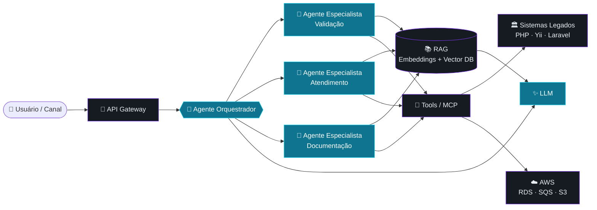

<!-- ═══════════════════════════════  HEADER  ═══════════════════════════════ -->
<div align="center">
  

  <a href="https://github.com/FeSilva">
    
  </a>

  <br/>

  
  
  
</div>

<br/>

<!-- ═══════════════════════════════  WHOAMI  ═══════════════════════════════ -->

```bash
felipe@dev:~$ whoami
> Felipe Feitosa da Silva — Desenvolvedor Full Stack Sênior & Líder Técnico

felipe@dev:~$ cat mission.txt
> Levar Inteligência Artificial para dentro de produtos reais:
> de sistemas legados em PHP a arquiteturas cloud-native na AWS.

felipe@dev:~$ uptime
> 13+ anos em produção · 20+ plataformas entregues · 0 medo de código legado
```

<!-- ═══════════════════════════════  ABOUT  ═══════════════════════════════ -->

## 🧬 `class FelipeSilva(Engineer)`

```python
from experience import years, platforms
from ai import LLM, Agent, VectorStore


class FelipeSilva(Engineer):
    """Full Stack Sênior | Tech Lead | AI Engineer"""

    location   = "São Paulo, BR 🇧🇷"
    experience = years(13)
    delivered  = platforms(20)

    ai_focus = [
        "Agentes de IA e orquestração multi-agente",
        "RAG: embeddings, vetorização e busca semântica",
        "LLMs integrados a sistemas legados (PHP/Yii/Laravel)",
        "Chatbots inteligentes em canais reais (WhatsApp)",
        "Automação de processos com IA",
    ]

    core = [
        "Arquitetura de Software & Clean Architecture",
        "APIs RESTful e integrações complexas",
        "Cloud AWS: EC2, RDS, SQS, Beanstalk, Auto Scaling",
        "Refatoração e modernização de sistemas legados",
    ]

    def mindset(self) -> str:
        return "IA com propósito: menos hype, mais produção."
```

<!-- ═══════════════════════════════  AI  ═══════════════════════════════ -->

## 🧠 IA Aplicada — como eu construo

> Não é só chamar uma API de LLM. É desenhar o sistema em volta dela: contexto, memória, ferramentas, observabilidade e custo.



<table>
<tr>
<td width="50%" valign="top">

### 🤖 Agentes & Orquestração
- Agente orquestrador que organiza e documenta demandas
- Agentes especialistas com papéis bem definidos
- Validação automatizada de ambientes contra manuais do sistema
- Tool calling / MCP para agir em sistemas reais

</td>
<td width="50%" valign="top">

### 📚 RAG & Conhecimento
- Ingestão de documentos (PDFs, manuais, bases internas)
- Vetorização recorrente com embeddings
- Busca semântica para respostas com contexto
- Bases de conhecimento sempre atualizadas

</td>
</tr>
<tr>
<td width="50%" valign="top">

### 💬 IA Conversacional
- Central de atendimento via WhatsApp com chatbot
- Integrações Twilio & Sendbird
- Fluxos híbridos: bot + atendimento humano

</td>
<td width="50%" valign="top">

### 🏛️ IA em Sistemas Legados
- LLMs plugados em aplicações PHP/Yii sem reescrita
- Camadas de integração seguras e incrementais
- Automação de rotinas operacionais com IA

</td>
</tr>
</table>

<!-- ═══════════════════════════════  STACK  ═══════════════════════════════ -->

## ⚙️ Tech Stack

#### 🧠 AI / ML

<p>
  
  
  
  
  
  
  
</p>

#### 💻 Linguagens & Frameworks

<p>
  
</p>
<p>
  
  
  
  
</p>

#### 🗄️ Dados · ☁️ Cloud · 🛠️ DevOps

<p>
  
</p>
<p>
  
  
  
  
  
  
</p>

#### 🔌 Integrações

<p>
  
  
  
  
</p>

<!-- ═══════════════════════════════  PROJECTS  ═══════════════════════════════ -->

## 🚀 Plataformas Entregues

| Domínio | Solução |
|:--|:--|
| 🧠 **Inteligência Artificial** | Agentes orquestradores · RAG sobre manuais de sistema · chatbot de atendimento |
| 📡 **IoT & Rastreamento** | Monitoramento de cargas e pessoas em tempo real via GPS · relatórios automáticos de eventos |
| 💬 **Atendimento** | Central via WhatsApp com chatbot integrado (Twilio & Sendbird) |
| 🏗️ **Operações** | Gestão de vistorias de obras · agenda e programação de visitas |
| 💰 **Fintech** | Gerenciamento de criptoativos · KPIs e cashback · fluxos de pagamento automatizados |
| ✍️ **Automação** | Assinatura eletrônica integrada · pipelines de processamento assíncrono (SQS) |
| 🌎 **Escala** | Plataforma multiestado com internacionalização (BR/COL) |

<!-- ═══════════════════════════════  STATS  ═══════════════════════════════ -->

## 📊 Telemetria

<div align="center">
  
  
  <br/>
  
</div>

<br/>

<div align="center">
  <picture>
    <source media="(prefers-color-scheme: dark)" srcset="https://raw.githubusercontent.com/FeSilva/FeSilva/output/github-snake-dark.svg" />
    <source media="(prefers-color-scheme: light)" srcset="https://raw.githubusercontent.com/FeSilva/FeSilva/output/github-snake.svg" />
    
  </picture>
</div>

<!-- ═══════════════════════════════  CONTACT  ═══════════════════════════════ -->

## 📡 Conexão

```yaml
open_to:
  - Arquitetura de sistemas com IA e agentes
  - Integração de LLMs em produtos existentes
  - Refatoração e modernização de legados
  - Cloud AWS e escalabilidade
  - Liderança técnica e mentoria
```

<div align="center">

[](https://www.linkedin.com/in/felipe-feitosa-da-silva-750596105/)
[](mailto:felipe__silva@outlook.com)
[](https://wa.me/5511977834813)

</div>

<div align="center">
  
  <sub><code>// transformando ideias em sistemas inteligentes desde 2013</code></sub>
</div>
